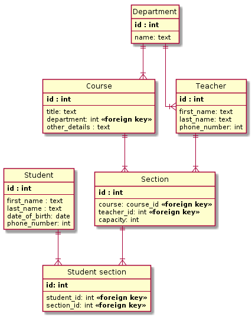
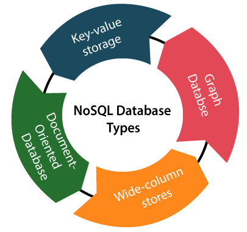
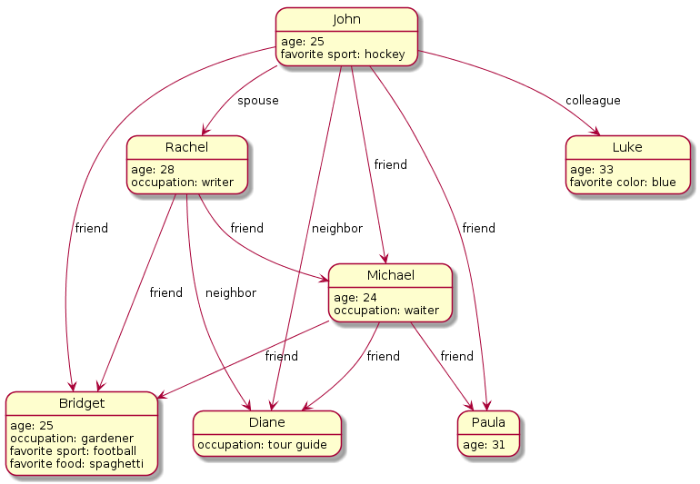

# Databases
## 1. Relational Database

This database is based on the relational data model, which stores data in the form of rows and columns, and together they form a table called relation. A relational database uses SQL for storing, manipulating, as well as maintaining the data. It was invented by E.F. Codd. Each table in the database carries a key that makes the data unique from others. 

In general, relational databases are often a good fit for any data that is regular, predictable, and benefits from the ability to flexibly compose information. Because relational databases work off of a schema, it can be more challenging to alter the structure of data after it is in the system. However, the schema also helps enforce the integrity of the data, making sure values match the expected formats, and that required information is included. Overall, relational databases are a solid choice for many applications because applications often generate well-ordered, structured data.

Examples: MySQL, Microsoft SQL Server, MariaDB, PostgreSQL, SQLite, Oracle etc.

## Properties of Relational Database
There are four commonly known properties of relational databases known as ACID properties, where:

### A means Atomicity: 
This requires that each transition be "all or nothing". If one part of the transaction fails, then the entire transaction fails, and the database state is left unchanged. For example, a transaction will either be committed or will abort.
### C means Consistency:
this property ensures that any successful transaction will bring the database from one valid state to another. If we perform any operation over the data, its value before and after the operation should be preserved. For example, the account balance before and after the transaction should be correct, i.e., it should remain conserved.

### I means Isolation: 
This property ensures that concurrent execution of transactions results in a system state that would be obtained if transactions were executed serially.
Thus, isolation between the data should remain isolated.

### D means Durability: 
It ensures that once it completes the transaction and commits the data, data changes should remain permanent.

## NoSQL(Not only SQL) Databases 
This a non-relational database design that provides flexible schemas for the storage and retrieval of data.  
It gained greater popularity due to the emergence of cloud computing, big data and high-volume web and data applications. They are chosen for their attributes around scale, performance and ease of use and do not use the row and column design. They are built for specific data models and do not typically use structured query language (SQL) to query data.  
Its flexible schema allow users to create and manage modern applications. It allows data to be stored in aschemaless or free-form fashion.
 

## Types of NoSQL Databases:

### a. Key-Value store:
Data in a key-value store is stored as a collection of key-value pairs.
It is the simplest type of database storage where it stores every single item as a key (or attribute name)-which is a unique identifier, holding its value, together. Both keys and values can be anything from simple integers or strings to complex JSON documents.  
They are great for storing user-session data, user-preferences, real-time recommendations, targeted advertisments and in-memory caching. 

**Key-Value pairs are not a great feat if you want to:** 
- query data on a specific value
-  need relationships between data values
- need multiple unique keys.
Example include Redis, Dynamo DB and Memcached.

### b. Document-Based: 
Document databases store each record and its associated data within a single document. They enable flexible indexing, powerful adhoc queries and analytics over collections of documents.  
Document databases are preferred for e-commerce platforms, medical records storage, CRM platforms and analytics platforms.

**Not a great fit if you want to:**
- Run complex search queries
- Perform multi-operation transactions  
Examples: Mongo DB, Document DB, Cloudant and Couch DB.

### c. Columns-Based:
Data in column-based databases are stored in cells grouped as columns insted of rows. A logical grouping of columns is known as a **column family**.  
Column-family databases are good when working with applications that require great performance for row-based operations and high scalability. 
Since it stores data as columns, access and searches are easier and faster.
It is great for systems that require heavy write requests, storing time-series data, weather data and IoT data.

**Not a great fit if you want to:**
- run complex queries.
- change patterns frequently.  
Examples are Cassandra and Apache HBase.

### d. Graph-Based: 
They use a graphical  model to represent and store data. Useful for visualizing, analyszing, and finding connections, between different pieces of data.

Rather than mapping relationships with tables and foreign keys, graph databases establish connections using the concepts of nodes, edges, and properties.  
Graph databases represents data as individual nodes which can have any number of properties associated with them. Between these nodes, edges (also called relationships) are established to represent different types of connections. In this way, the database encodes information about the data items within the nodes and information about their relationship in the edges that connect the nodes.
**They are great for** real-time product recommendations, social networks, Network diagrams, fraud detection and fccess management.  
Examoles are neo4J, Cosmos DB, JanusGraph and Dgraph.

